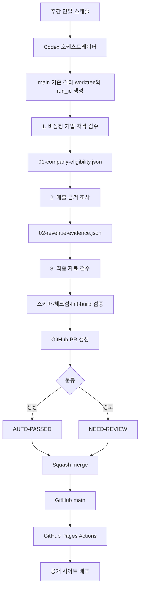

# AI Startup Index 아키텍처 및 운영 방식

> 마지막 갱신: 2026-08-29 KST

## 1. 목적

AI Startup Index는 한국의 독립 비상장 AI 스타트업을 선별하고, 최신 공식
매출 근거를 검증하여 매출 내림차순 TOP 100을 제공하는 데이터룸이다.

이 문서는 다음 네 영역의 실제 구성과 실행 계약을 정의한다.

1. 웹사이트와 GitHub Pages 배포
2. 주간 데이터 조사 서브에이전트 루프
3. GitHub 브랜치·PR·자동 병합
4. 스케줄과 운영 복구 절차

## 2. 현재 실제 상태

| 영역 | 현재 상태 | 비고 |
|---|---|---|
| 소스 저장소 | [`euisuk-chung/top100_kr_startup`](https://github.com/euisuk-chung/top100_kr_startup) `main` | 애플리케이션과 감사 이력의 기준 |
| `main` 보호 | Active Ruleset | 브랜치 삭제와 force push 차단 |
| 운영 사이트 | GitHub Pages | <https://euisuk-chung.github.io/top100_kr_startup/> |
| Codex Desktop Scheduled task | **미등록** | Codex 앱의 Scheduled 화면에는 작업이 없음 |
| Windows 예약 작업 | **비활성화** | 작업 정의만 남아 있으며 실행되지 않음 |
| 에이전트 루프 정의 | 저장소에 존재 | `.codex/workflows/weekly-data-refresh.toml` |
| PR 자동 병합 정책 | 구현됨 | `[AUTO-PASSED]` / `[NEED-REVIEW]` |
| GitHub merge 후 배포 | GitHub Actions | `main` push마다 Pages 정적 배포 |
| 화면 데이터 | **프로토타입 하드코딩** | 실제 조사 데이터 파일과 UI 연결이 아직 필요 |

중요: Windows 예약 작업은 2026-08-29에 비활성화했다. Codex Desktop의
네이티브 Scheduled task도 아직 등록되지 않았으므로 현재 자동 실행되는
스케줄은 없다. 향후 스케줄의 활성화와 비활성화는 Codex 앱 Scheduled
화면에서만 관리한다.

## 3. 전체 구조



세 에이전트는 선행 결과를 mailbox로 인계하기 때문에 반드시 순차 실행한다.
각 단계 내부에서 기업별 조사를 병렬화할 수는 있지만 다음 단계는 이전 단계가
끝나고 산출물 검증이 완료된 후에만 시작한다.

## 4. 소스 오브 트루스

| 파일 | 역할 |
|---|---|
| `AGENTS.md` | 루프 실행 시 저장소 전역 운영 규칙 |
| `.codex/workflows/weekly-data-refresh.toml` | 스케줄 프롬프트, 단계, 게이트, 순위, merge 정책 |
| `.codex/agents/private_company_auditor.toml` | 비상장·독립 스타트업 자격 판정 지침 |
| `.codex/agents/revenue_research_auditor.toml` | OpenDART·회사 공식 사이트·최신 뉴스 매출 조사 지침 |
| `.codex/agents/data_pr_reviewer.toml` | TOP 100 재산정, 최종 검수, PR 및 merge 지침 |
| `.codex/mailbox/manifest.schema.json` | 실행 manifest 데이터 계약 |
| `audit/mailbox/<date>/<run_id>/` | 단계 간 인계와 감사 이력 |
| `.github/workflows/deploy-pages.yml` | GitHub Pages 정적 빌드와 배포 |

대화 메시지는 진행 상황을 설명할 수 있지만 mailbox 산출물을 대신하거나
덮어쓸 수 없다.

## 5. 주간 에이전트 루프

### 5.1 실행 초기화

오케스트레이터는 매 실행마다 다음 작업을 수행한다.

1. 최신 `main`을 기준으로 격리 worktree를 만든다.
2. KST `run_date`와 고유한 `run_id`를 생성한다.
3. `audit/mailbox/<run_date>/<run_id>/manifest.json`을 초기화한다.
4. 기준 SHA, 이전 실행 ID, trigger, 브랜치, 단계별 초기 상태를 기록한다.
5. `codex/data-refresh-YYYY-MM-DD` 브랜치를 사용한다.

동일 주차에 열린 데이터 갱신 PR이 있으면 새 PR을 중복 생성하지 않고 기존
실행을 재개하거나 명시적인 hard stop으로 종료한다.

### 5.2 1단계: 비상장 기업 리스트 검수

`private_company_auditor`가 다음 조건을 확인한다.

- 한국 법인인가
- AI가 핵심 제품 또는 서비스인가
- KRX/KIND 기준 상장사가 아닌가
- 대기업 또는 대기업 계열사가 아닌가
- 인수·합병, 폐업, 청산, 해외 법인, 중복 기업이 아닌가

결과는 `INCLUDE`, `EXCLUDE`, `REVIEW`로 분류하여
`01-company-eligibility.json`에 기록한다.

### 5.3 2단계: 기업 매출 조사

`revenue_research_auditor`는 1단계 `INCLUDE` 기업만 조사한다.

근거 우선순위는 다음과 같다.

1. OpenDART 공식 공시
2. 회사 공식 사이트·감사보고서·보도자료
3. 검색일 기준 최신 뉴스

뉴스 단독 수치는 `VERIFIED`로 확정하지 않는다. 모든 순위 기업은 공통
사업연도의 연간 매출을 사용하며 결과는 `02-revenue-evidence.json`에 기록한다.

### 5.4 3단계: 최종 자료 검수

`data_pr_reviewer`는 다음 작업을 수행한다.

- `INCLUDE + VERIFIED` 전체 후보를 다시 정렬
- `revenue_krw` 내림차순, 동률이면 `company_id` 오름차순
- 최대 100개 공개
- `NEW_ENTRY`, `RE_ENTRY`, `MOVED_UP`, `MOVED_DOWN`, `UNCHANGED`,
  `DROPPED_OUT`, `REMOVED_INELIGIBLE`, `UNRANKED_UNVERIFIED` 이력 기록
- lint, build, mailbox 스키마와 체크섬 검증
- PR 생성, 태그 분류 및 squash merge

## 6. PR 태그와 자동 병합

MVP 정책은 기술적으로 유효한 PR을 자동 병합하는 것을 기본으로 한다.

### `[AUTO-PASSED]`

- hard stop이 없음
- 주요 데이터 경고가 없음
- PR 제목 접두사와 GitHub label에 동일하게 기록
- 검증 후 자동 squash merge

### `[NEED-REVIEW]`

- 신규 진입 또는 재진입
- TOP 100 탈락 또는 자격 제외
- 미검증 매출
- 30% 이상 매출 변경
- 출처 충돌 또는 조사 경고
- upstream 차단으로 만들어진 audit-only PR

MVP에서 `NEED-REVIEW`는 **병합 후 사람의 후속 확인이 필요하다는 표시**다.
기술 검증을 통과한 경우 이 태그도 자동 병합한다.

### 자동 병합 hard stop

다음 조건에서는 어떤 태그도 부여해 병합하지 않는다.

- lint 또는 build 실패
- mailbox 스키마 또는 체크섬 실패
- 예상하지 않은 base/head 브랜치
- merge conflict
- push, PR 생성 또는 merge 실패

병합 결과, 병합 시각과 squash commit SHA는 PR 코멘트에 기록한다.

## 7. 스케줄 운영

### 7.1 권장 목표: Codex Desktop Scheduled task

하나의 Codex Scheduled task만 등록하고 그 task가 전체 루프를 끝까지 수행한다.
OpenAI의 Scheduled tasks는 지정 프로젝트 또는 격리 worktree에서 실행할 수
있으며, 로컬 파일을 다루는 작업은 해당 컴퓨터와 Codex 앱이 실행 가능한
상태여야 한다. 공식 설명은 [OpenAI Scheduled tasks](https://learn.chatgpt.com/docs/automations)를 참고한다.

권장 설정:

- 이름: `Weekly AI startup data refresh`
- 주기: 매주 월요일 06:00 KST
- workspace: 이 저장소 루트
- worktree: 활성화
- 모델: `gpt-5.6-luna`, reasoning `high`
- task 수: 1개

등록 프롬프트:

```text
Run one complete scheduled loop defined by AGENTS.md and
.codex/workflows/weekly-data-refresh.toml, which are the source of truth.
Start from latest main, create a unique KST mailbox run, execute
private_company_auditor, revenue_research_auditor, and data_pr_reviewer
strictly in sequence, then create a main-targeted PR. Classify it as
AUTO-PASSED or NEED-REVIEW, run every deterministic hard-stop validation,
and invoke the configured merge helper so the task ends only at merged,
no_change, or a documented hard stop. Never push weekly data directly to main.
```

Codex Desktop task가 생성된 것을 Scheduled 화면에서 확인하기 전에는 네이티브
스케줄이 활성화됐다고 간주하지 않는다.

### 7.2 비활성 폴백: Windows 작업 스케줄러

로컬 PC의 `AIstartup_dashboard Weekly Refresh` 작업은 비활성화되어 있다.
작업 정의는 복구 참고용으로 남아 있지만 실행되지 않는다. 운영 스케줄은
Windows 작업 스케줄러에서 다시 활성화하지 않고 Codex Desktop Scheduled
화면에서만 관리한다.

## 8. GitHub Pages 배포

`.github/workflows/deploy-pages.yml`은 `main` push마다 동일 UI를 정적 export해
GitHub Pages에 공개한다. 저장소가 프로젝트 페이지이므로 정적 자산에는
`/top100_kr_startup` base path를 적용한다.

배포 흐름:

1. `main` push 또는 수동 `workflow_dispatch`
2. `npm ci`
3. `npm run build:pages`로 `out/` 정적 export
4. Pages artifact 업로드
5. GitHub Pages production 배포

배포 실패는 데이터 PR merge를 되돌리지 않는다. Actions 로그를 확인한 뒤
동일 Git SHA에서 workflow를 재실행한다.

## 9. 관측성과 복구

각 실행은 다음 정보를 보존한다.

- run ID와 이전 run ID
- 기준 Git SHA와 실행 브랜치
- 단계별 시작·종료 시각과 상태
- 산출물 SHA-256
- 기업 추가·제외·순위·매출 변경
- 출처 커버리지와 경고
- PR URL, merge 태그와 merge 결과

복구 원칙:

- upstream 산출물 체크섬이 같으면 실패한 단계부터 재시도
- 같은 run 디렉터리를 덮어쓰지 않고 새 run ID 생성
- 열린 같은 주차 PR이 있으면 중복 PR 생성 금지
- GitHub merge 성공 후 Pages만 실패하면 동일 merge SHA에서 workflow 재실행
- 조사 실패 또는 차단 시 승인 데이터는 변경하지 않고 audit-only 이력만 보존

## 10. 남은 MVP 작업

우선순위 순서:

1. Codex Desktop Scheduled task 실제 등록 및 Scheduled 화면 확인
2. 하드코딩된 `app/page.tsx` 데이터를 검증된 데이터 파일/API로 교체
3. GitHub Pages 배포 실패 알림 보강
4. GitHub 필수 체크 보강
5. 4주간 실행 이력 확인 후 경고 임계값 조정
